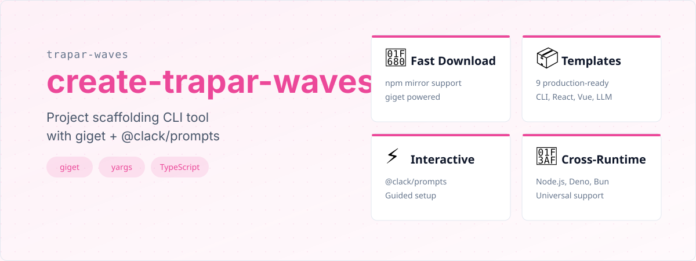

# create-trapar-waves


---

[中文](./readme/README-CN.md) | [日本語](./readme/README-JP.md) | [Русский язык](./readme/README-RU.md)

> A project scaffolding CLI tool for downloading and creating projects from curated templates, leveraging the Rstack ecosystem (Rsbuild/Rspack/Rslib) for optimal build performance.




- **Lightning Fast Downloads:** Leverages your locally configured npm mirror for blazing fast template downloads via `giget`.
- **Template Selection:** Choose from a curated list of production-ready project templates covering CLI, React, Vue, and LLM development.
- **Interactive Prompts:** Guided setup with intuitive prompts powered by `@clack/prompts`.
- **Automatic .gitignore:** Generates a standard `.gitignore` file for your new project.
- **Next Steps Guidance:** Provides clear instructions for getting started after project creation.
- **Rstack Ecosystem Integration:** All templates leverage the powerful Rstack ecosystem (Rsbuild/Rspack/Rslib) for optimal build performance.
- **Code Quality Assurance:** Templates ship with Husky, lint-staged, and ESLint integration for consistent code quality.
- **Cross-Runtime Support:** Works with Node.js, Deno, and Bun out of the box.


- **Language:** TypeScript (v5.9.x)
- **Build Tool:** tsup
- **CLI Framework:** yargs
- **Interactive Prompts:** `@clack/prompts`
- **Logging:** `consola` + `rslog`
- **HTTP Client:** `ofetch`
- **Template Download:** `giget`
- **Utilities:** `destr`, `ufo`, `picocolors`
- **Ecosystem:** `@trapar-waves/captain`

See the [package.json](./package.json) for a full list of dependencies.


All templates leverage the powerful Rstack ecosystem (Rsbuild/Rspack/Rslib) for optimal build performance:

| Template | Description |
|----------|-------------|
| `cli-template` | CLI development template with TypeScript, tsup, consola, and picocolors |
| `llm-template` | LLM application development template with AI tools, Zod, Vitest, and Rslib |
| `react-antd-pro` | Enterprise app template based on React 19 and Ant Design Pro 5 with TanStack toolchain |
| `react-mantine-tailwind` | Modern UI template integrating Mantine UI and Tailwind CSS |
| `react-tailwind` | React + Tailwind CSS starter with Rsbuild, TypeScript, and ESLint |
| `react-tanstack` | Production-ready React template with TanStack Query/Router |
| `react-three-maplibre` | 3D geospatial visualization library with Three.js, MapLibre, and AntV |
| `react-visgl-maplibre` | Geospatial 3D rendering with Three.js, Deck.gl, and MapLibre |
| `vue-tailwind` | Vue 3 + Tailwind CSS starter with modern development tools |


### Prerequisites

- Node.js (>= 18.x recommended)
- Package manager (npm, yarn, pnpm, or bun)

### Installation

Install globally:

```bash
# npm
npm install -g create-trapar-waves

# yarn
yarn global add create-trapar-waves

# pnpm
pnpm add -g create-trapar-waves

# bun
bun add -g create-trapar-waves
```

### Usage

Create a new project interactively:

```bash
# Via pnpm create (Recommended)
pnpm create trapar-waves

# Via npx
npx create-trapar-waves

# Via pnpm dlx
pnpm dlx create-trapar-waves

# Via bunx
bunx create-trapar-waves
```

Follow the interactive prompts to select a template and configure your project.


```
├── bin/              # CLI entry point
├── dist/             # Build output
├── src/              # Source code
│   ├── commands/     # CLI command handlers
│   ├── prompts/      # Interactive prompt logic
│   ├── templates/    # Template definitions and metadata
│   └── utils/        # Shared utilities
├── tsup.config.ts    # tsup build configuration
├── tsconfig.json     # TypeScript configuration
├── eslint.config.mjs # ESLint configuration
└── package.json      # Project dependencies and scripts
```


Contributions are welcome and greatly appreciated! Please follow these steps to contribute:

1. Fork the repository
2. Create your feature branch (`git checkout -b feature/amazing-feature`)
3. Commit your changes (`git commit -m 'Add some amazing feature'`)
4. Push to the branch (`git push origin feature/amazing-feature`)
5. Open a Pull Request


MIT License © 2023-Present Trapar Waves

## 👤 Author

- **Rikka:** [admin@rikka.cc](mailto:admin@rikka.cc)
- **GitHub Profile:** [Muromi-Rikka](https://github.com/Muromi-Rikka)

## 🔗 Links

- **Repository:** [https://github.com/Trapar-waves/create-trapar-waves](https://github.com/Trapar-waves/create-trapar-waves)
- **Issues:** [https://github.com/Trapar-waves/create-trapar-waves/issues](https://github.com/Trapar-waves/create-trapar-waves/issues)
